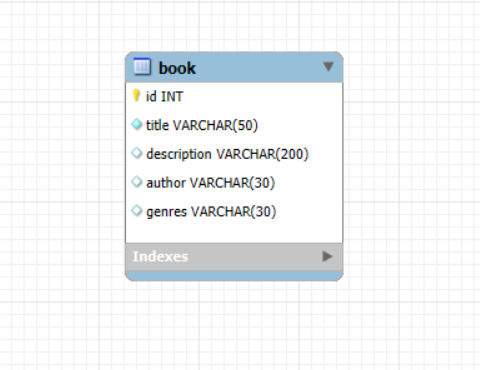
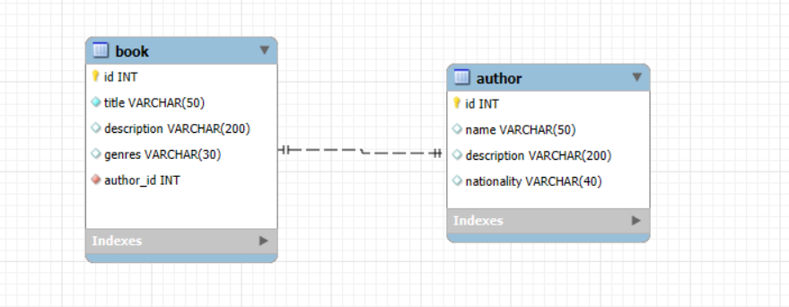

# Django Migrations Practice – Homework 05

This project demonstrates how to work with Django models and migrations in a productive environment.  
The goal is to learn how migrations are created, applied, and tracked when adding new models and relationships.

---

## Project Setup

- **Framework**: Django
- **Branch**: `hw-05` (created from `main`)

---

## Models

### 1. Initial Model

### 2. Author Model with Relation

### 3. Genres Model  with Relation

