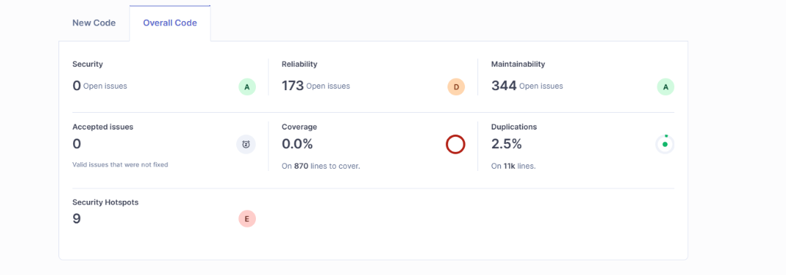
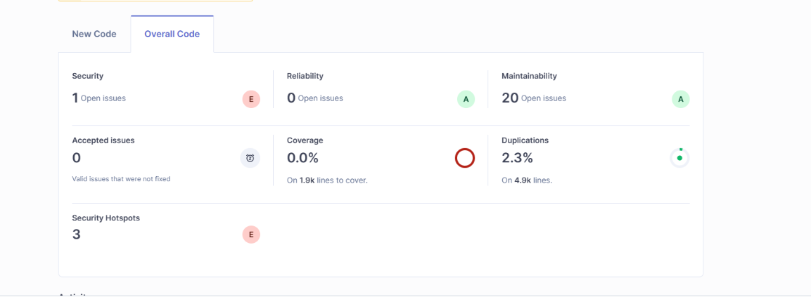

#  Homework 08 — SonarQube Setup and Project Analysis

This task involved deploying **SonarQube** using **Docker Compose** and performing code quality and security scans on both the **frontend** and **backend** parts of my project.

---

## 1. Setup Overview

I used **Docker Compose** to run a SonarQube instance along with a PostgreSQL database.  
The configuration was defined in a file named `docker-compose.yml`.

## How to run
docker-compose up -d

Then open http://localhost:9000

Create Token

Install sonar and start scan

## Scan Results

### 🧩 Frontend (Next.js)

### ⚙️ Backend (Django)

