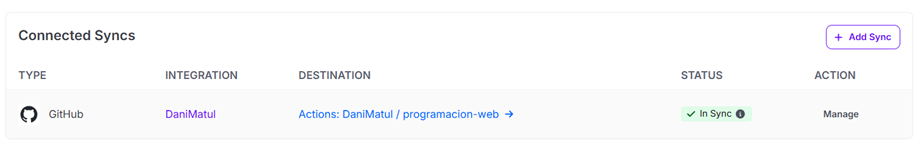
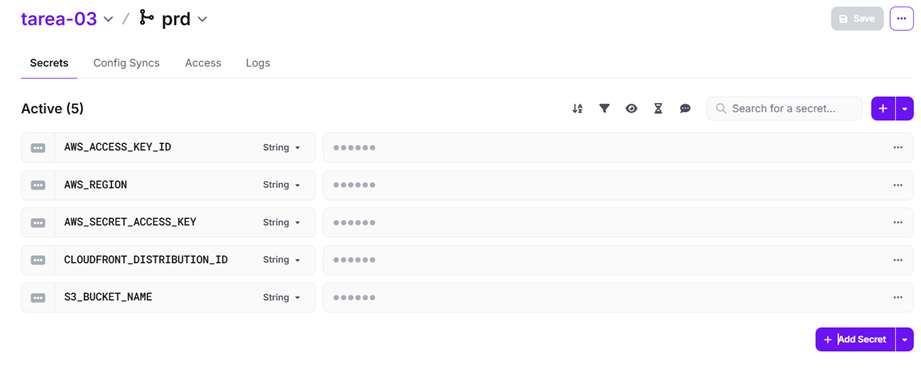
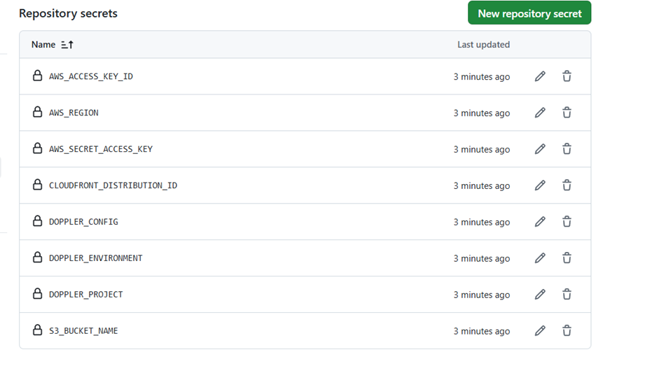
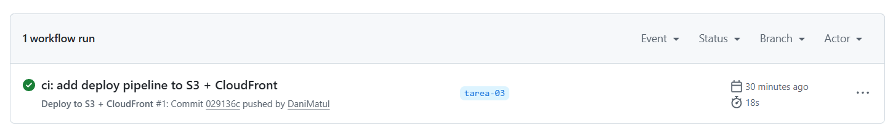

# Tarea 03 – Deployment a CDN (CloudFront)

## Repositorio
Este repo será usado para todas las entregas. Rama de trabajo: `tarea-03` (creada desde `main`).

## Capturas requeridas
1. **Doppler → Config Syncs**  
   
2. **Doppler → Variables (Secrets)**  
   
3. **GitHub → Actions Secrets**  
   
4. **Última ejecución del Pipeline**  
   

## CDN URL
CloudFront: dmw4pzamd0fpi.cloudfront.net