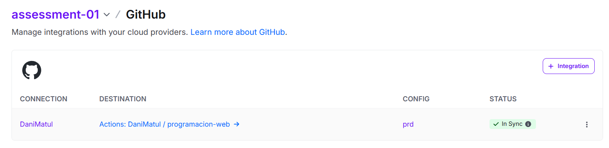
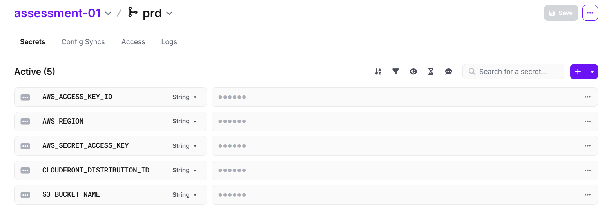
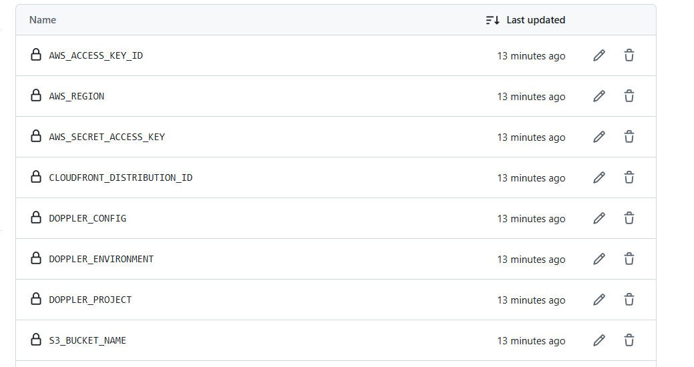
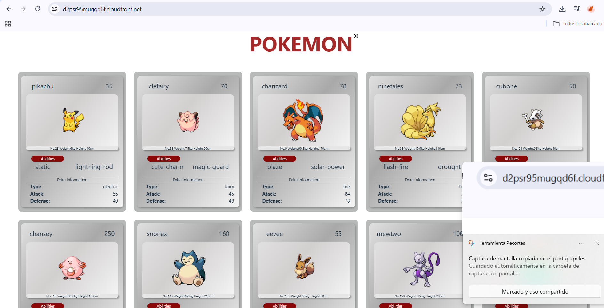

# Assessment-1 – Deployment a CDN (CloudFront) and create page of Pokemon

## Repository
This repository has been created to submit activities. 
Branche: `assessment-1` (based on `main`).

## Screenshots required
1. **Doppler → Config Syncs**  
   
2. **Doppler → Variables (Secrets)**  
   
3. **GitHub → Actions Secrets**  
   
4. **Última ejecución del Pipeline**  
   

## CDN URL
CloudFront: d2psr95mugqd6f.cloudfront.net