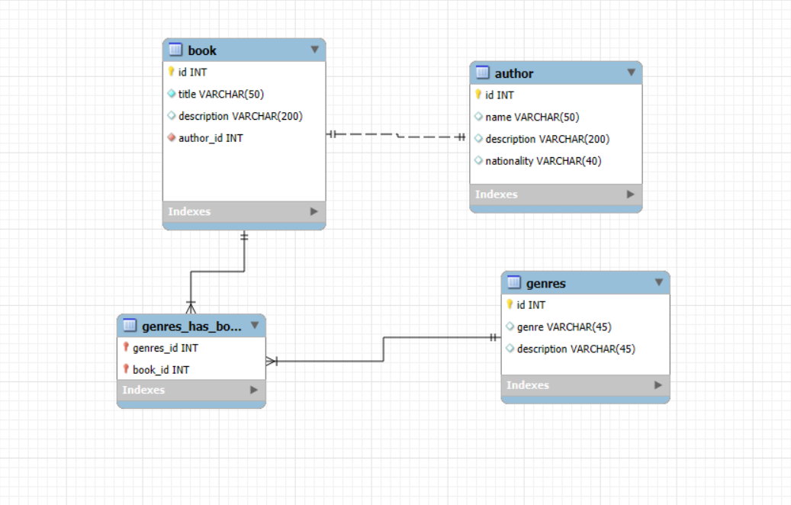

# Django Migrations Practice – Homework 06

This project extends the previous homework (HW-05) by containerizing the Django API using **Docker** and **Docker Compose**.  
The goal is to quickly deploy the project with all dependencies installed and a connected PostgreSQL database.

---

## Project Setup

- **Framework**: Django  
- **Branch**: `hw-06` (created from `main`)  
- **Database**: PostgreSQL (Docker service)  
- **Environment**: Docker + Docker Compose  

---

## Models

### 1. Initial Model

### 2. Author Model with Relation

### 3. Genres Model with Relation

---

## 🐳 Docker Setup

This project uses Docker to run the Django application and PostgreSQL database.

### Files added for this homework
- `Dockerfile` → Builds a lightweight image for the Django API without using the root user.  
- `docker-compose.yml` → Defines services for the Django app and PostgreSQL database.  
- `.env` → Contains default environment variables for the application (database credentials, etc.).

